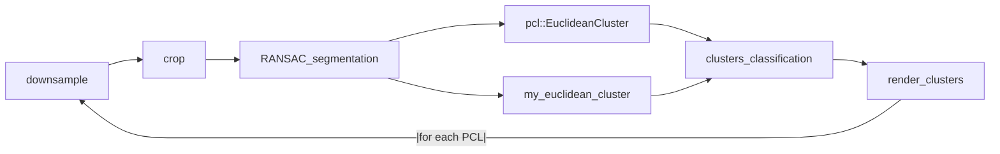
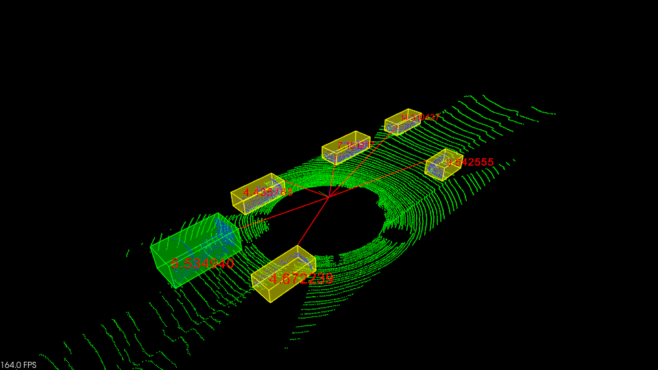
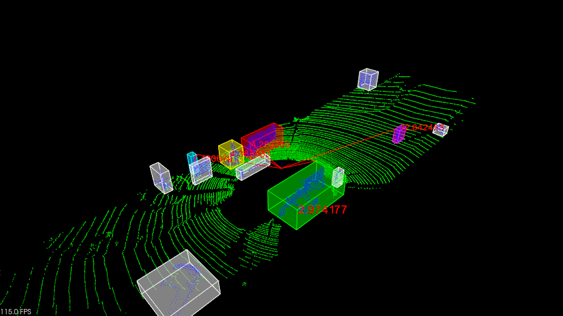

*Academic Year: 2025/2026*

# Assignment #1 Euclidean clustering object detection
## Instructions 
### Objective: Find and segment cars and pedestrians lying on the road
1. Implement an euclidean clustering program using the PCL library as studied during the lectures. Please follow the instructions and comments detailed in the code (cluster_extraction.cpp)
2. Optional assignment: Implement the algorithm that performs the euclidean clustering (use the proximity function and follow the pseudo-code), plots the distance of each cluster, color nearby front vehicles and stress your approach on dataset 2.
3. Try to make your solution work on dataset 2. If you cannot successfully provide a solution. Write a short report explaining why.
       
### Tasks evaluated (evaluated over 15 points):
+ The code compiles and works (2 points)
+ Good cluster detection without false positives and high frame rate (5 points)
+ Optional clustering implementation (1 point)
+ Solution working on dataset 2 or report provided explaining how to make it work (2 point)
+ Extend the code to support any additional useful functionality (5 points). Examples:
    * Plot the distance of each cluster w.r.t ego vehicle 
    * Color in red the vehicles that are both in front of and 5 meters away from the ego vehicle 
    * Any other functionality is up to your discretion (use other strategies to create the clustering rather than the Euclidean heuristic)

### OS requirements:
- A Linux based operating system or virtual machine (Ubuntu 18-24 is fine)
- PCL LIBRARY (sudo apt-get install pcl-tools | sudo apt install libpcl-dev)
- cmake (sudo apt-get install cmake)

## Implementation details
The proposed implementation includes all the tasks, both the mandatory ones and the optional clustering implementation.
Each frame is processed following this pipeline:


### Additional functionalities
The following functionalities have been implemented in the code:
- **Distance of each cluster from the ego vehicle**. This function computes the distance of a cluster from the ego vehicle, selecting the nearest cluster's vertex with respect to the origin of the axis (corresponding to the ego vehicle). Each cluster's distance is plotted on the scene. The line connecting the origin of the axis to the nearest selected point is plotted as well.
- **Signal when a cluster is too close to the ego vehicle**. This function takes the distance computed at the previous step and simply draws a red bounding box around the cluster if it's too close to the ego vehicle. The threshold distance has been set to 5 meters.
- **Cluster classification**. This function has been implemented primarily for the purpose of the stress test on dataset 2, but it probably works better on dataset 1. This function aims to categorize each cluster into 4 different classes: *pedestrian, bike, car and truck*. The classification is executed based on the dimension of the cluster (see *cluster_classification* for further details).



### Stress test on dataset 2
This dataset is characterized by a way richer environment compared to dataset 1. Using a simple clustering approach without any type of filtering, each object composed of at least *MIN_CLUSTER_SIZE* points and a maximum of *MAX_CLUSTER_SIZE* points is considered to be a cluster. In particular, in this dataset several objects appear: streetlamps, road signs, raised traffic islands, stakes, walls and buildings.
The cluster classification function aims to filter out these unwanted objects in order to keep only the clusters that represent a vehicle, a pedestrian or a bike. This filtering mechanism has been implemented taking into consideration just the dimension of the bounding box rendered around the cluster.

For example, a cluster whose height is less than 2.0 meters and whose width and length are both around 1.0 meter is probably a pedestrian. Opposite, if a very big cluster is detected, it's probably a truck. 

"Probably" is the right keyword here, since with this approach the algorithm still finds a lot of false positives and/or confuses the different classes of clusters. Actually, it's pretty hard to distinguish a truck from a wall based only on dimensions, and a hybrid approach using also a camera should be implemented to achieve an (almost) perfect classification.

By the way, by running the program on dataset 2, it's possible to see that the algorithm finds the bike in front of the vehicle and tracks it pretty well during the whole scene (although sometimes confusing it with a pedestrian). The truck that appears on the right of the vehicle seems to be tracked as well. The same goes for the cars parked on the sides of the road at the end of the scene. All clusters that are classified as "*UNKNOWN*" are rendered with a white bounding box but this behavior could be changed by commenting the compiler directive *RENDER_UNKNOWN_CLUSTERS*.



## Instructions to compile the code:
```bash
cd build
cmake ..
make
```

#### IMPORTANT:
You must supply the dataset as a folder composed of pointcloud files to the program to make it run. For example:
```bash
./cluster_extraction ../dataset_1
```


