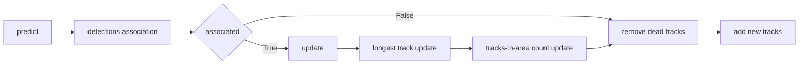
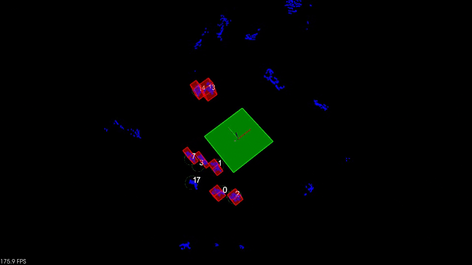
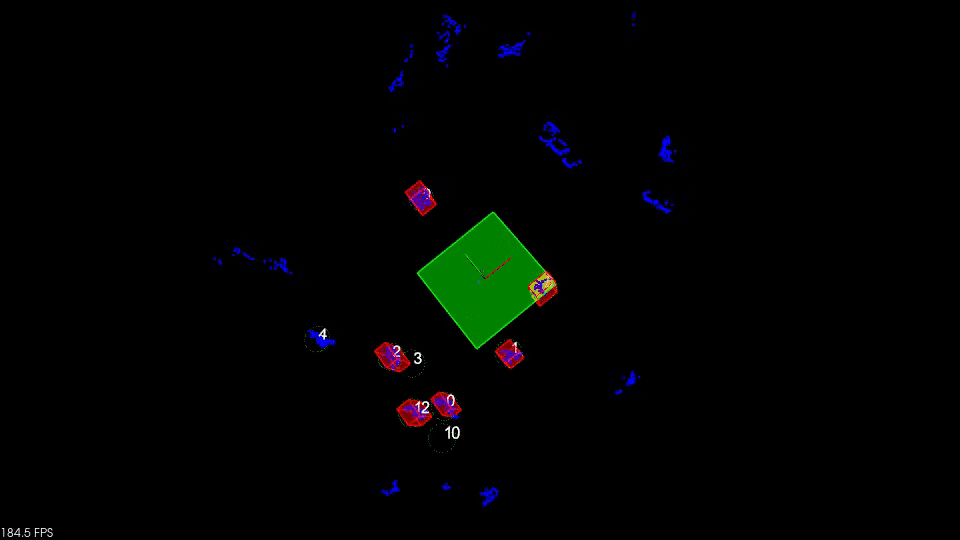

*Academic Year: 2025/2026*

# Assignment #2 Kalman Filter Multi Object Tracker
## Instructions 
### Goals

This code implements a Kalman Filter to track the pedestrians on the LiDAR point cloud using the given clusters.
The handling of the point cloud and the clustering is given, as well as the tracker implementation and the viewer. 
Only some parts are missing. 
You are not required to implement anything, we do not expect for the solution should to be delivered. 
However, this project will be the starting point for the technical interview. 

#### Files to complete
- ***KalmanFilter.cpp***: implement the Kalman Filter predict and update and initialize the covariance matrix
- ***Tracker.cpp***: implement the following components: 
    - Implement the initialization (initialize the variables)
    - Implement the track logic
    - Implement the removal tracklets logic
    - Implement the data association to associate clusters with tracklets (i.e. tracked objects).
#### Files to ignore
Everything related to the viewer or cloud processing (e.g. Rendered.cpp or CloudManager.cpp). The clustering is given and no contribution it expected on that.

Suggest possible improvements to enhance the solution.

Note: the 'v' key turns off the LiDAR clusters (hence the software just uses the Kalman Filter estimations). Could be helpful to validate the implementation.

### Evaluation metrics (over 15 points extra 5 optional points): 

KF tracker compile and work (0-8 points)
- The score will be assigned according to the performance of the tracker (tracking performance, timing performance, code quality, and comments) 
- The more the originality of the code the better the degree will be

Readme including different scenarios and conclusions (2 points)
- Play with the role of the covariances and report your experience
    
Implement any cool functionality! (0-5 points)
- Return the id and length of the path of the track that has traveled the longest path
- Define an area and count the persons that has entered in that area
- Define an area and return the ID of the person who has been in that area the longest
- Is it possible to extend the state vector to support the yaw angle? If so, why and how. Try to implement it
- Feel free to propose your idea!

## Implementation details
The proposed implementation includes all the tasks, both the mandatory ones and other cool functionalities. 

The totality of the tracking logic takes place in either ```Tracker``` class and ```Tracklet``` class. The following graph shows the full pipeline executed by these two classes on a single frame, including the optional tasks as well, detailed later in this section.


### Core functionalities

The ***detection association*** step is done by computing the Euclidean distance between current (live) tracks and the centroid of each detected cluster.

The ***dead tracks removal*** step is done based on two thresholds:
- *lost frame counter* which counts the number of frames the track has not been updated (meaning that no detection has been associated with this track for the previous **N** frames). The higher this threshold is, the higher the possibility to recover a lost tracklet in the scene (for example, a person who exited from the scene and re-entered the lidar view after a while). As a drawback, with a too high value for this threshold, after a person exits from the lidar view, the Kalman filter prediction might catch another *real* track and confuse the people tracked. 
- *covariance threshold* which keeps track of the value of the covariance matrix during the life of a track and discards it if it reaches too high values, meaning that that track has not received any updates recently and then its own state has accumulated a lot of variance caused by the intrinsic guessing nature of the prediction phase.

A new track is created by the ***new track addition*** for each unassociated detection. Indeed, an unassociated detection means that it's not close enough to an existing track; therefore, a separate new track must be created.

### Optional functionalities

In order to compute the ***longest track*** the following changes have been made to the code:
- added a private variable ```Tracklet::length_```. This memorizes the length for each tracklet.
- added a private variable ```Tracker::longest_path_``` which is a pair of ID of the tracklet and its length. This memorizes the longest tracklet recorded so far. 
- added method ```Tracklet::lengthUpdate```. This method is executed by each tracklet after every update phase. This method updates the tracklet distance by adding to the current length the Euclidean distance between the current position and the position computed by the update phase.
- added method ```Tracker::getLongestTracklet``` that simply gets the value of the current longest path.

The following changes have been made to the code in order to ***count people entered in a defined area*** and ***get the tracklet that spent the most time in the area***:
- added a private variable ```Tracker::area_``` which is of type ```viewer::Box``` and is useful to keep the dimensions of the area itself
- added a private vector ```Tracker::area_tracks_frames_``` which contains the number of frames in which the tracklet has been recorded to be within the area.
- added method ```Tracker::getAreaCount``` which counts the number of cells greater then zero in the ```Tracker::area_tracks_frames_``` vector.
- added method ```Tracket::Tracker::getLongestTrackInArea``` which get the maximum value recorded in the ```Tracker::area_tracks_frames_``` vector, along with the corresponding tracklet ID.

The following changes have been made to KalmanFilter.cpp in order to support the ***yaw angle***:
- the state vector ```x_``` now contains 5 values.
- the covariance matrix ```P_``` now contains 5x5 values.
- the transition matrix ```F_``` has been extended to support the yaw angle and now contains 5x5 values. The motion model assumes a constant yaw angle.
- the process covariance matrix ```Q_``` now contains 5x5 values. Keep in mind that in the absence of a sensor that detects the yaw angle, the process covariance is the only responsible for the yaw angle changes. For this assignment's purpose, the yaw angle has been modeled as depending on velocity on both axes.

## In-depth analysis of how covariance affects the behavior of the tracker

### More weight for prediction
Using the following settings, the tracker trusts mostly in the prediction. This translates into a Kalman gain that gives way more weight to the prediction; therefore, even if a new measurement is supplied to the tracker, it doesn't give it much weight. The convergence of the state vector to the measurement in this case is really slow.
```c
P_ = Eigen::MatrixXd(5, 5);
P_ << 0.001, 0., 0., 0., 0.,
    0., 0.001, 0., 0., 0.,
    0., 0., 100., 0., 0.,
    0., 0., 0., 100., 0.,
    0., 0., 0., 0, 100.;

R_ = Eigen::MatrixXd(2, 2);
R_ << 200., 0.,
    0., 200.;
```
The following clip shows that circles (corresponding to Kalman filter states) are mostly in different position w.r.t cluster position (corresponding to lidar measurements)


### More weight for update
Using the following settings, the tracker relies mostly on the update. This translates into a Kalman gain that gives way more weight to the measurement; therefore, on each update the state vector converges almost instantly on the measurement values.
```c
P_ = Eigen::MatrixXd(5, 5);
P_ << 200., 0., 0., 0., 0.,
    0., 200., 0., 0., 0.,
    0., 0., 100., 0., 0.,
    0., 0., 0., 100., 0.,
    0., 0., 0., 0, 100.;

R_ = Eigen::MatrixXd(2, 2);
R_ << 0.001, 0.,
    0., 0.001;
```

The following clip shows that, in case of interruption of the lidar measurement, circles recover instantly the position and coincide with the clusters.


### Optimal settings
The following are the best settings found by trial and error. With these settings, tracker sometimes still fails to distinguish two people belonging to the same cluster, but tracks the most of the scene correctly. 

The distance threshold setting is particularly important since a too low value would result in a lot of "ghost" tracks spawning and a too high value would result in a higher chance of the tracker confusing people between them. The values of both covariance and loss threshold serve mainly to keep tracking a person for a (short) while even if not updated for some frames.

Initial covariance matrix has been set to 0.2 on both X and Y since the first position is supplied by the lidar, which has a measurement noise of 0.0225, and then its measured value shall be characterized by a very low uncertainty.
```c
distance_threshold_ = 0.6;
covariance_threshold = 5.0; 
loss_threshold = 30; 

P_ = Eigen::MatrixXd(5, 5);
P_ << 0.2, 0., 0., 0., 0.,
    0., 0.2, 0., 0., 0.,
    0., 0., 100., 0., 0.,
    0., 0., 0., 100., 0.,
    0., 0., 0., 0, 100.;
```

## Instructions to compile the code:

To build the project: 
```bash
mkdir build
cd build
cmake ..
make -j2
```
Download the dataset with the point cloud from here (https://drive.google.com/file/d/1TWfV1odleih6d0SG7q2Sbs1jbZ4oSPkP/view?usp=share_link) and place the ```log``` folder inside the project workspace.


In order to run the project it is needed to supply the log folder path to the binary as a command line argument. For example:
```bash
./main ../log
```

