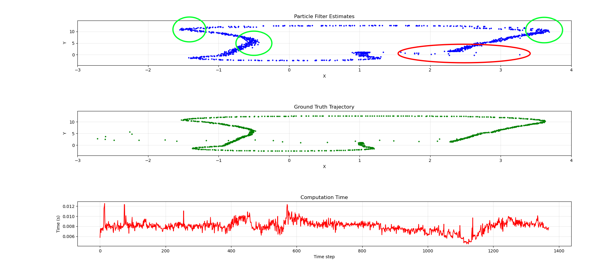
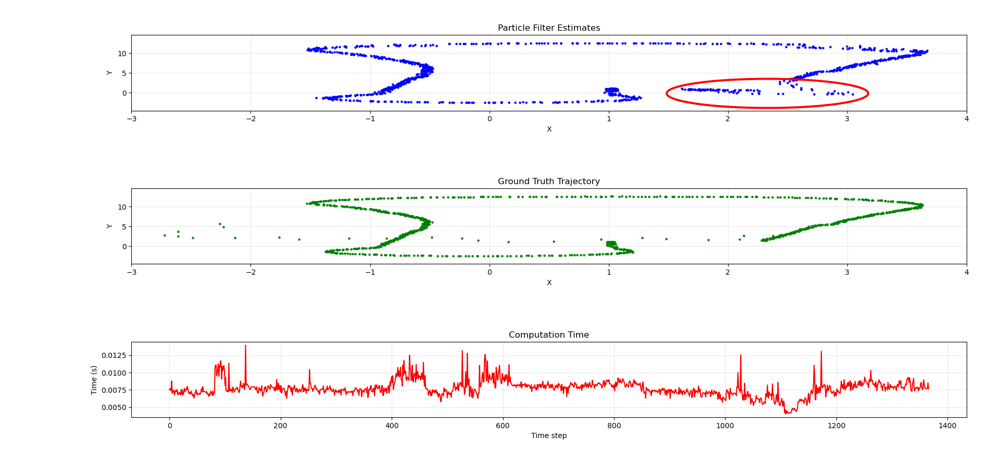
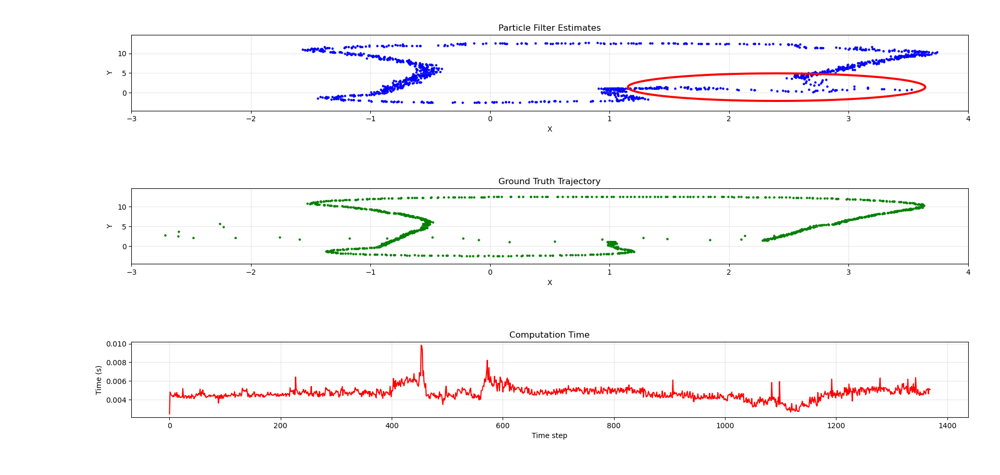
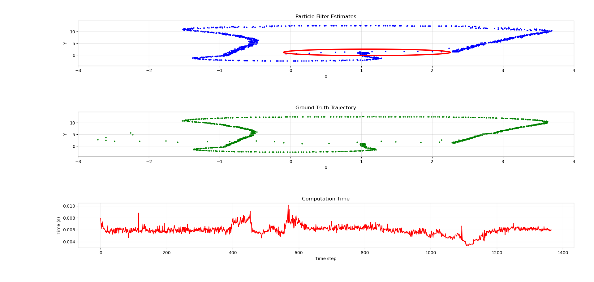
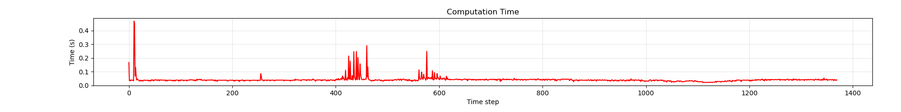
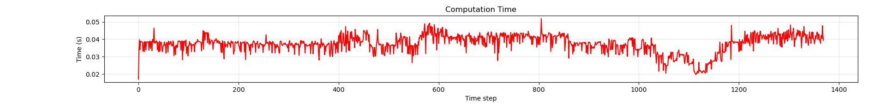
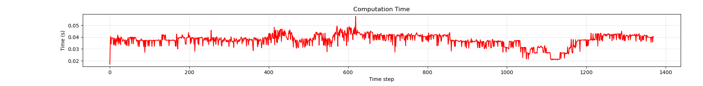
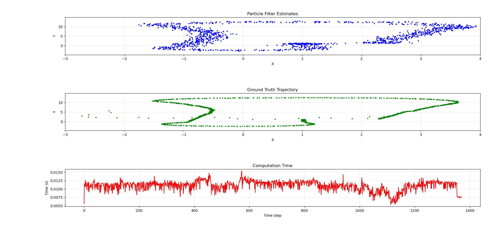
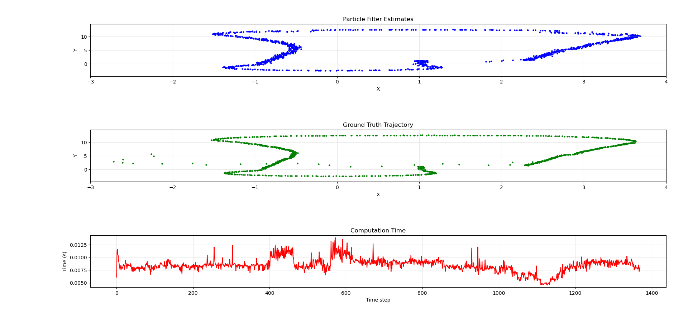
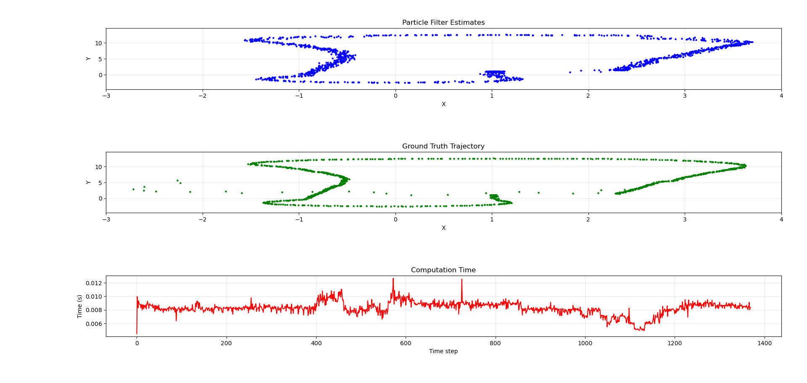

*Academic Year: 2025/2026*

# Assignment #3 Particle filter localization:
## Instructions 
### Goals

Localize a forklift using the LiDAR and landmarks as reference

### Evaluation metrics (over 15 points)

#### Particle filter works and localizes the vehicle during the whole simulation (7 points) 
* In the code you will find different TODOs. The main tasks are related to the initialization, prediction, update, resampling and etc... (see the slides and source code)
* The random and guess initialization implementation is 1 point
* The quality of the code and optimizations of the code will be positively evaluated (try to surprise me)
* Note: Please send me the source code of the best localization solution you are able to achieve.

#### Report describing the particle filter performance under different scenarios. Just one-two-three paragraphs by scenario. Each paragraph should include a discussion of the trajectory estimated and execution time (3 points)
* As we have seen during the lectures, the particle filter performance can be influenced by different factors (number of particles, error of the sensors or motion model...).
* After executing the particle filter algorithm, a file called "res.txt" will be produced. This file will contain information regarding the estimation in X,Y coordinates of the best particle; the ground truth in X,Y coordinates; and the execution time of your solution (from initialization to resampling). All this information is used to compute the output that can be seen after executing "plotter.py"
* The more the scenarios the higher the grade. Originality and quality of the report will be considered to determine grades (number of scenarios required is 3)
* Note: The report shall include the description of the scenario, the trajectory of the forklift and the configuration used.
        
#### Implement your own resampling method and explain it (2 points)
https://bisite.usal.es/archivos/resampling_methods_for_particle_filtering_classification_implementation_and_strategies.pdf

#### Implement any functionality on top of the particle filter. Optimize the code, any improvement will be positively (very) evaluated (3 points or more)
* Any other data association technique
* Explore the idea of combining a particle filter with a Kalman filter to improve the localization process
* Implement an adaptive particle filter where the number of particles and resampling frequency adjusts dynamically based on the uncertainty in the system
* ...........

### Important Note:
- All the TODOs are in the file called "particle_filter.cpp" & "main.cpp" but you are more than free to modify any source file
- In the folder you find 2 txt files:
    * pf_slam.txt: Hipert's 'best' particle filter implementation
    * res.txt: Nacho's 'prototype' particle filter implementation (feel free to use my result as reference)        
    
### How to compile the code:
To compile the code run this command in a different terminal (in the src/particle folder): 
```bash
rm -rf build install log
source /opt/ros/jazzy/setup.bash
colcon build --symlink-install 
```

To run the code:
```bash
source install/setup.bash
source /opt/ros/jazzy/setup.bash
ros2 run pf pf_node
```

As soon as you launch the executable you can start the simulation. To do so, open another terminal and write:
```bash
source /opt/ros/jazzy/setup.bash
ros2 bag play data/techboard_log/
```

The executable generates a file called 'res.txt'
        
To generate the plot just write: ```python3 plotter.py``` (pay attention to the output file called res.txt with the trajectory and execution time of your implementation) 

#### Requirements
##### ROS bag:
Download the log file here: https://drive.google.com/drive/folders/1Fi4yyKeRFSrix5cQPQOUn3OYy-EWmrn0?usp=sharing

#### OS requirements:
ROS2 (the installation command depends on the Linux distribution)
Example: 
```bash
sudo apt install libpcl-dev ros-jazzy-pcl-conversions ros-jazzy-pcl-msgs #Ubuntu 24
```

## Analysis of Different Scenarios for the Particle Filter

### Reference Scenario
This scenario is used as an initial reference for all subsequent scenarios. The parameters used in this case represent an intermediate value within the suggested ranges. More specifically, it is suggested to test a range from 0.01 to 0.5 for the robot motion noise, and a range from 0.1 to 0.5 for the sensor noise.

#### Parameters
| | X | Y | theta |
| :--- | :---: | :---: | :---: |
| Initialization Noise | 0.1 | 0.1 | 0.1 |
| Motion Noise | 0.2 | 0.2 | 0.2 |
| Sensor Noise | 0.2 | 0.2 | |

| Parameter | Value |
| :--- | :---: | 
| Number of Particles | 1000 |
| Resampling Algorithm | Wheel |
| Initialization Type | From GPS |

#### Results
The results obtained demonstrate that the robot is localized very approximately. The trajectory identified in the two straight sections along the x-axis is, actually, quite accurate. The situation is different for the trajectories identified in the straight sections along both axes and in the curves, where the precision of the particle filter decreases drastically.

---

### Scenario 01 - Reduction of noise on theta
In this scenario, an attempt is made to increase the precision in curve detection. For this reason, the noise related to the turning angle (theta) is reduced in such a way as to generate a high number of particles characterized by a similar turning angle. This measure was adopted following the observation of the trajectory of the ground truth: it can be noted, in fact, that the robot to be localized does not make sharp turns and, for this reason, generating particles with very different turning angles is not useful.

#### Parameters
| | X | Y | theta |
| :--- | :---: | :---: | :---: |
| Initialization Noise | 0.1 | 0.1 | 0.1 |
| Motion Noise | 0.2 | 0.2 | ***0.05*** |
| Sensor Noise | 0.2 | 0.2 | |

| Parameter | Value |
| :--- | :---: | 
| Number of Particles | 1000 |
| Resampling Algorithm | Wheel |
| Initialization Type | From GPS |

#### Results
The results obtained demonstrate what was previously predicted. Indeed, the reduction of noise on the turning angle allows for more precise localization of all the curves made by the robot. The difference compared to the reference scenario is visible especially in the green circled sections, where the dispersion of the particles is much lower. However, the trajectory identified in the straight sections along both axes is still quite inaccurate and "wide". Furthermore, the dispersion in the inital steps is accentuate as can be seen in the red circled region. This is due to the fact that having less exploraiton range for theta, the particle filter struggle to find a right appoximation initially.



---

### Scenario 02 - Reduction of noise on X and Y axes
The objective of this scenario is to reduce the width of the oblique straight sections. To achieve this result, therefore, the motion noise on both axes is reduced. With this modification, the particle filter distributes the generated particles at a smaller distance from each other. 

#### Parameters
| | X | Y | theta |
| :--- | :---: | :---: | :---: |
| Initialization Noise | 0.1 | 0.1 | 0.1 |
| Motion Noise | ***0.05*** | ***0.05*** | 0.05 |
| Sensor Noise | 0.2 | 0.2 | |

| Parameter | Value |
| :--- | :---: | 
| Number of Particles | 1000 |
| Resampling Algorithm | Wheel |
| Initialization Type | From GPS |

#### Results
As visible in the graph, the trajectory identified by the particle filter is overall very precise and very similar to the ground truth. As predicted, the width of the oblique straight sections has been reduced. However, by further reducing the parameters related to motion noise on the two axes, the precision decreases drastically, leading to the identification of completely incorrect trajectories. As seen in previous scenario, an initial dispersion can be seen in the circled region, caused by the low motion noise itself.



---

### Scenario 03 - Reduction of the number of particles
This scenario aims to study the tradeoff between the number of particles and the execution time for each iteration. In particular, while a fairly high number of particles (1000) was used in the previous scenarios, in this scenario the trajectory identified by using only 100 particles is studied.

#### Parameters
| | X | Y | theta |
| :--- | :---: | :---: | :---: |
| Initialization Noise | 0.1 | 0.1 | 0.1 |
| Motion Noise | 0.05 | 0.05 | 0.05 |
| Sensor Noise | 0.2 | 0.2 | |

| Parameter | Value |
| :--- | :---: | 
| Number of Particles | ***100*** |
| Resampling Algorithm | Wheel |
| Initialization Type | From GPS |

#### Results
From the graph, it is possible to observe that due to the reduction in the number of particles, the inaccuracy in the trajectory increases significantly, which, in this scenario, is quite "wide", indicating a greater dispersion of the particles. This translates into the fact that, with the same noise, the particle density decreases, causing more pronounced jumps between the positions of the best particles at each iteration. The advantage introduced in this scenario, however, is represented by the execution time, which is halved compared to the case of the reference scenario. As seen in previous scenario, an initial dispersion can be seen in the circled region, caused by the low motion noise itself.



---

### Scenario 04 - Random initialization of particles
This scenario aims to highlight any differences present in the trajectory identified by the implemented particle filter in the case where the initial position of the robot is not available. In this case, therefore, the initialization phase provides for the generation of particles distributed uniformly over the entire map.

#### Parameters
| | X | Y | theta |
| :--- | :---: | :---: | :---: |
| Initialization Noise | 0.1 | 0.1 | 0.1 |
| Motion Noise | 0.05 | 0.05 | 0.05 |
| Sensor Noise | 0.2 | 0.2 | |

| Parameter | Value |
| :--- | :---: | 
| Number of Particles | 500 |
| Resampling Algorithm | Wheel |
| Initialization Type | ***Random*** |

#### Results
The graph highlights a peculiarity compared to all other scenarios: there is a line of points very distant from each other. These points describe the positions of the best particle during the first iterations of the particle filter. This behavior is due to the fact that, initially, the particles are very sparse and it is necessary to wait for the algorithm to attribute a greater weight to the most representative particles in order to stabilize the position; only once the best particles (i.e., those generated near the robot) are correctly weighted the particle filter proceed normally. Actually, this result shows a better tracking wrt GPS initialization, probably caused by a wider exploration of the solution space in the initial steps: this avoids the problem of the large dispersion seen in the previous scenarios.

It is also emphasized that the number of particles was set to 500 following some tests: using 100 particles, the algorithm converges with difficulty since the probability that a particle is generated near the robot is reduced; conversely, using 1000 particles, the system behavior becomes very similar to the scenario with GPS initialization as it is probable that a good number of particles are generated near the robot.



---

### Scenario 05 - Comparison Between Different Resampling Methods
In this scenario, we want to compare the execution times of the different resampling methods and, to accentuate any differences, a very high number of particles (5000) is used. In particular, two further resampling methods are considered: systematic and stratified.

#### Systematic Resampling
This method involves creating an array representing the cumulative distribution of particle weights. The resampling occurs in this way:
1. An initial random value is selected in an interval between 0 and 1/N, where N is the number of particles.
2. Subsequently, for each iteration, the value of 1/N is added to the random number calculated in point 1. The obtained number is used to select a new particle to sample from the cumulative distribution array: if the obtained number is greater than probability Pi but less than probability Pj, then particle j is selected.

#### Stratified Resampling
This is a method very similar to systematic resampling. The only difference from the latter is represented by the way the number dedicated to the selection of a new particle is calculated. In particular, instead of generating a random number between 0 and 1/N in the initial phase and adding a fixed amount equal to 1/N at each iteration, stratified resampling generates a random number at each iteration within each section. This means that the number used for sampling is calculated as: x = random(0, 1/N) + (1/N) * i where i corresponds to the value of the inductive variable.

#### Parameters
| | X | Y | theta |
| :--- | :---: | :---: | :---: |
| Initialization Noise | 0.1 | 0.1 | 0.1 |
| Motion Noise | 0.05 | 0.05 | 0.05 |
| Sensor Noise | 0.2 | 0.2 | |

| Parameter | Value |
| :--- | :---: | 
| Number of Particles | 10000 |
| Resampling Algorithm | ***Systematic and Stratified*** |
| Initialization Type | From GPS |

#### Results
The graphs show a slight difference in execution time. It can be observed, in particular, that wheel resampling presents many more peaks that are much higher than the other two resampling methods which, on the contrary, are more stable. More specifically, the number of iterations done in the resampling step by the wheel method is not known: it depends on the (random) value of beta. Conversely, the other two methods execute always the same number of iterations, approximately. The trajectory identified by the three resampling methods is identical and for this reason it was omitted in this scenario.

##### Wheel resampling


##### Systematic resampling


##### Stratified resampling


### Scenario 06 - Increased noise on both axes and theta
By this scenario, we want to show the impact of a pretty big motion noise on both axes and theta.

#### Parameters
| | X | Y | theta |
| :--- | :---: | :---: | :---: |
| Initialization Noise | 0.1 | 0.1 | 0.1 |
| Motion Noise | ***0.5*** | ***0.5*** | ***0.5*** |
| Sensor Noise | 0.2 | 0.2 | |

| Parameter | Value |
| :--- | :---: | 
| Number of Particles | 1000 |
| Resampling Algorithm | Wheel |
| Initialization Type | From GPS |

#### Results
The result obtained shows a trajectory way more approximative compared to the previous scenarios: this is due to the fact that at each prediction step, the particles are spreaded in a larger area. However, the filter converges almost instantly without an initial "dispersive" phase, as noted in scenarios with less noise.



### Optimal scenario
This scenario aims to show the best solution found based on the previous described experiments. The motion noise on both axes can be set to a small value since we do not expect a sudden big movement of the vehicle. We must stay aware of sudden angle variations though: this is the reason for a bigger noise on theta.

#### Parameters
| | X | Y | theta |
| :--- | :---: | :---: | :---: |
| Initialization Noise | 0.1 | 0.1 | 0.1 |
| Motion Noise | ***0.05*** | ***0.05*** | ***0.2*** |
| Sensor Noise | 0.2 | 0.2 | |

| Parameter | Value |
| :--- | :---: | 
| Number of Particles | 1000 |
| Resampling Algorithm | Wheel |
| Initialization Type | From GPS |

#### Results
The achieved result can be considered the best one. It is based on a tradeoff between approximation, solution space exploration and execution time. The trajectory does not suffer from an initial dispersion and it tracks really good sudden angle variations.



## Optional functionality: Adaptive Resampling implementation
The objective of an adapative resampling is to adapt the resampling step based on the actual status of the particle filter. In the proposed implementation the adapative particle filter widen or narrow the area in which new particles are spreaded during the resampling step. More specifically, when the filter is stable the resampling variance is low, when the filter is degenerating (huge weight on few particles) the resampling variance is high. By this action, we want to promote the diversification of particles in case the filter is degenerating.

This implementation is based on the following paper: [A tutorial on particle filters for online nonlinear/non-Gaussian Bayesian tracking](https://ieeexplore.ieee.org/document/978374)

It considers the ESS (Effective Sample Size) as a measure for the current performance of the filter. Ideally, ESS should have values close to N: this indicates that every particles have approximately the same weight and there is no danger of degeneration and/or impoverishment. Conversely, values close to 1 indicate that a tiny amount of particles have the majority of the weight. This last situation needs immediate attention in order to prevent the filter degeneration.

### Parameters

### Results




